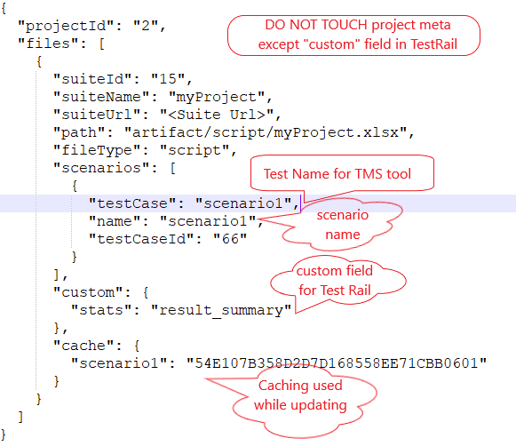

**Configure Project Meta File**:- 
Configure `project.tms.json` file in the `.meta` folder of project whose script to be imported.
This json requires `projectId` from the TMS tool where the scripts to be imported. 
`projectId` can also be project name depending on provided tms tool. 

**Import Testcases**:- 
Test cases can be imported using Nexial batch file [nexial-tms-importer](./BatchFiles#nexial-tms-importer).
After importing testcases to tms tool, `project.tms.json` json file will be automatically updated with imported test 
cases like below. For reference only showing following `project.meta.json` after importing testcases from script file. 
 
For example, `project.tms.json` should look like this after import, 

 