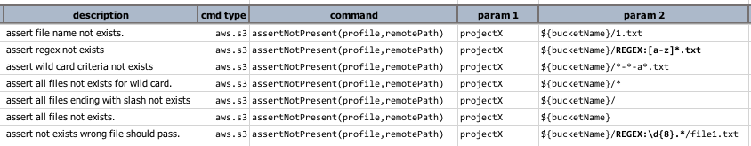
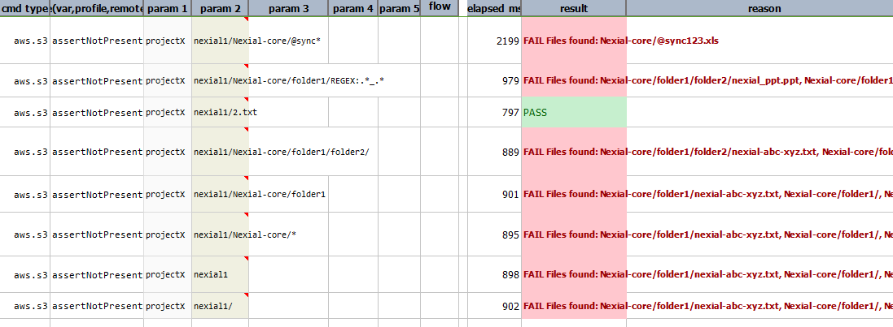

### Description
This command checks if there are no files matching the pattern provided in `remotePath` (i.e in the S3 bucket/folder).

Check [here](index#s3profile) for more information regarding `profile`.

### Parameters
- **profile** - the [profile](index#s3profile) added in the data file which contains AWS credentials and connectivity
- **remotePath** - the pattern which specifies the folder, file or a pattern of files.

### Example
**Script**: 

**Output**: 

### See Also
- [`assertPresent(profile,remotePath)`](assertPresent(profile,remotePath))
