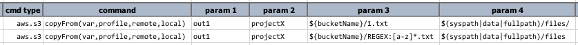
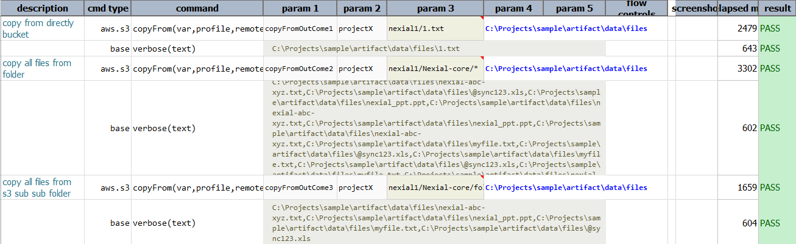
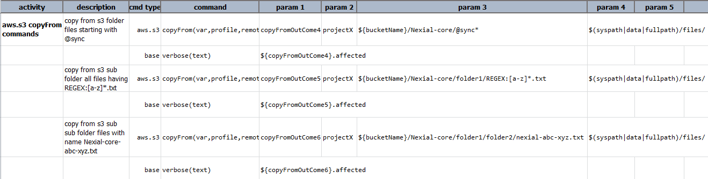
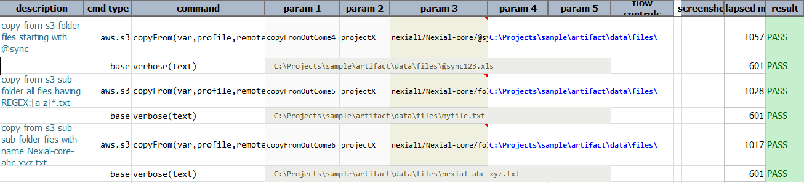

### Description
This command copies all the files matching the criteria specified for the target files from the target bucket/folder 
to the local directory.  For example, `remote` represents a set of S3-bound objects such as, `my_bucket/my_folder/*`, 
and `local` represents a local directory such as `C:\my_directory`, the command copies all the matching S3 objects 
from `remote` to the `local` directory. The **`*`** acts like a wildcard.

Similarly if `remote` is specified as `my_bucket/my_folder/report*`, then all the S3 objects in `my_bucket/my_folder` 
starting with `report` in the object name are copied to `local`.

However, this command does not work well if `remote` contains subdirectories.  In fact, the concept of "subdirectory" 
in S3 can be confusing since it is possible for a S3 object to contain path characters like `/` or `\ `.

Check [here](index#s3profile) for more information regarding `profile`.

### Parameters
- **var** - the variable name to represent the outcome of this command.
- **profile** - the [profile](index#s3profile) added in the data file which contains AWS credentials and connectivity.
- **remotePath** - the pattern which specifies the folder, file or a pattern of files.
- **local** - the directory to which the files should be copied.

### Example
**Script**: 

**Output**: 

**Script**: 

**Output**: 

### See Also
- [`moveFrom(var,profile,remote,local)`](moveFrom(var,profile,remote,local))
- [`copyTo(var,profile,local,target)`](copyTo(var,profile,local,target))
