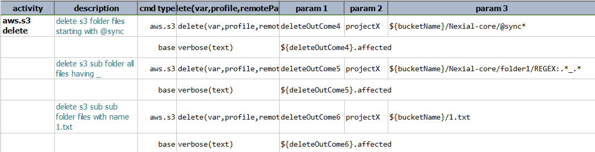
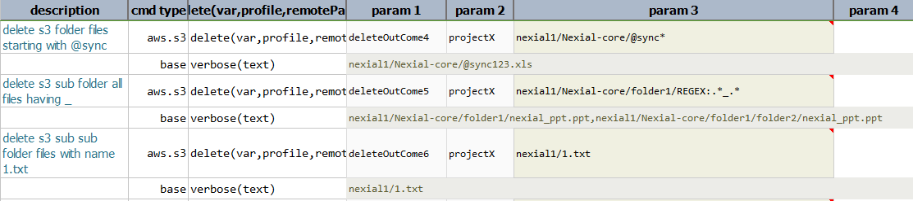
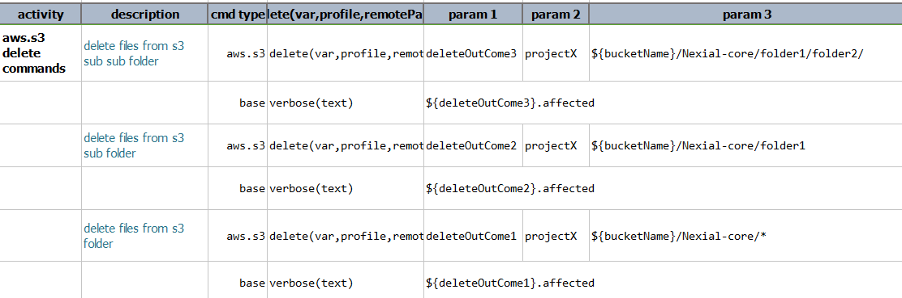
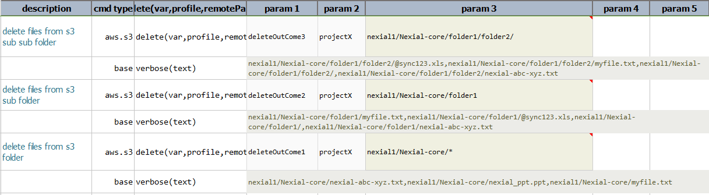

### Description
This command deletes all the files matching the criteria specified for the target files from the target bucket/folder. 
For example, if the criteria (`remotePath`) is `my_bucket/my_folder/*` it deletes all the files from 
`my_bucket/my_folder`. The **`*`** acts like a wildcard specifying any or none i.e it matches any no. of characters 
in place of `*` or no character at all.

Similarly if the remote is given as `my_bucket/my_folder/report*`, all the files starting with `report` are deleted. 
Another example is `my_bucket/my_folder/*-*`, where all the files containing `-` are deleted. 

### Parameters
- **var** - the variable name to represent the outcome of this command.
- **profile** - the [profile](index#s3profile) added in the data file which contains AWS credentials and connectivity.
- **remotePath** - the pattern which specifies the folder, file or a pattern of files.

### Example
**Script**: 

**Output**: 

**Script**: 

**Output**: 

### See Also
- [`list(var,profile,remotePath)`](list(var,profile,remotePath))
