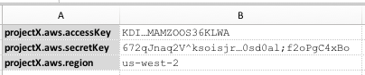

<a href="https://aws.amazon.com/s3/" class="external-link" target="_nexial_link">S3, or Simple Storage Service</a>, is 
a cloud-based storage service provided by Amazon AWS. One can utilize such service to manage files and content in the 
cloud. Nexial supports the use of S3 via various automation capabilities (below) such as move, copy,
delete, list, etc.


For example, suppose we have a "profile" named as `projectX`: 

`projectX` will be used as a "profile" throughout the "aws.s3" commands for S3-related automation.



The "aws.s3" command type represents a series of commands regarding AWS S3.

### Available Commands
- [`assertNotPresent(profile,remotePath)`](assertNotPresent(profile,remotePath))
- [`assertPresent(profile,remotePath)`](assertPresent(profile,remotePath))
- [`copyFrom(var,profile,remote,local)`](copyFrom(var,profile,remote,local))
- [`copyTo(var,profile,local,target)`](copyTo(var,profile,local,target))
- [`delete(var,profile,remotePath)`](delete(var,profile,remotePath))
- [`list(var,profile,remotePath)`](list(var,profile,remotePath))
- [`moveFrom(var,profile,remote,local)`](moveFrom(var,profile,remote,local))
- [`moveTo(var,profile,local,target)`](moveTo(var,profile,local,target))
