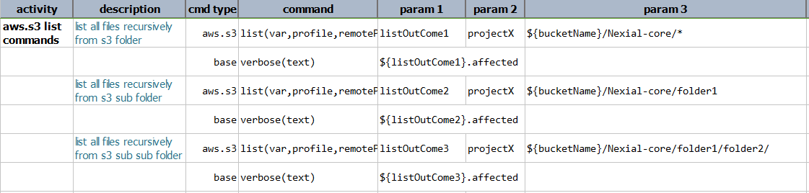
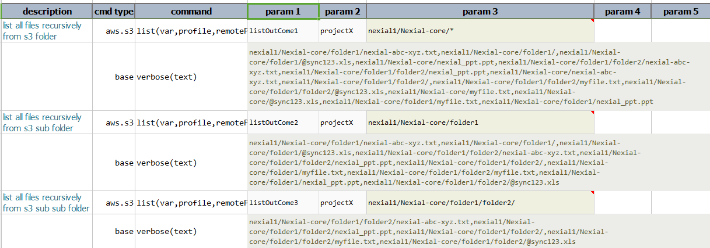
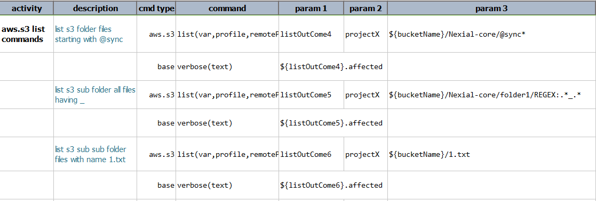
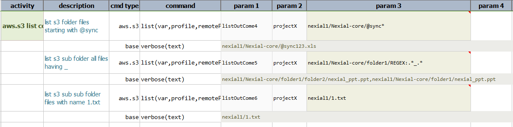

### Description 
This command lists all the files/folders matching the criteria specified in the remote path corresponding to AWS S3 
bucket. For example, if the criteria(value of the parameter remote)  is like my_bucket/my_folder/abc* it lists all 
the files/folders from the target bucket's sub-folder **my_folder** recursively. The **'\*'** acts like a wildcard 
specifying any or none i.e it matches any no. of characters in place of * or no character at all. So we get all the 
keys that starts with **`my_bucket/my_folder/abc`** like `my_bucket/my_folder/abc/`, `my_bucket/my_folder/abc.txt`, 
`my_bucket/my_folder/abc/folder1`,` my_bucket/my_folder/abc/xyz/f.jpg`, etc in the output.  

Similarly, users can use the `REGEX:<regex-pattern>` to specify the list of files and folders from the S3 path. 
The `remotePath` need not be a regex or wildcard pattern. It can be a normal path like **`my_bucket/my_folder`** 
where we get all the keys starting with `my_bucket/my_folder`.

### Parameters
- **var** - the variable name to represent the outcome of this command.
- **profile** - the [profile](index#s3profile) added in the data file which contains AWS credentials and connectivity.
- **remotePath** - the pattern which specifies the folder, file or a pattern of files.

### Example
**Script**: 

**Output**: 

**Script**: 

**Output**: 

### See Also
- [`assertPresent(profile,remotePath)`](assertPresent(profile,remotePath))
