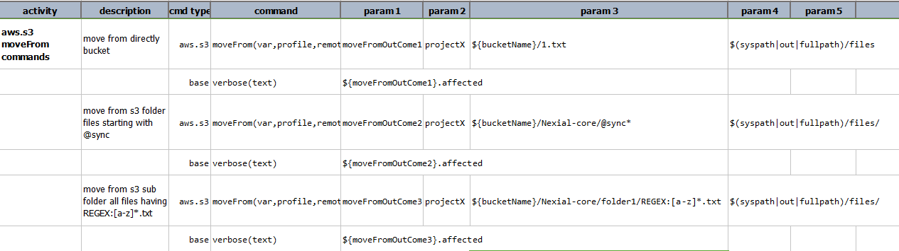
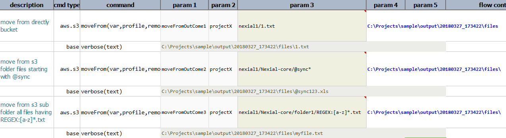
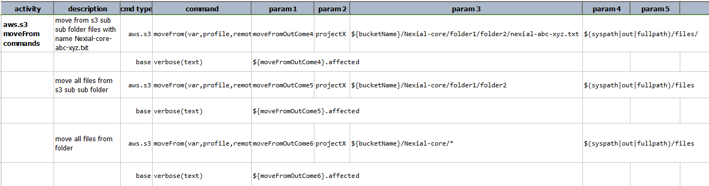
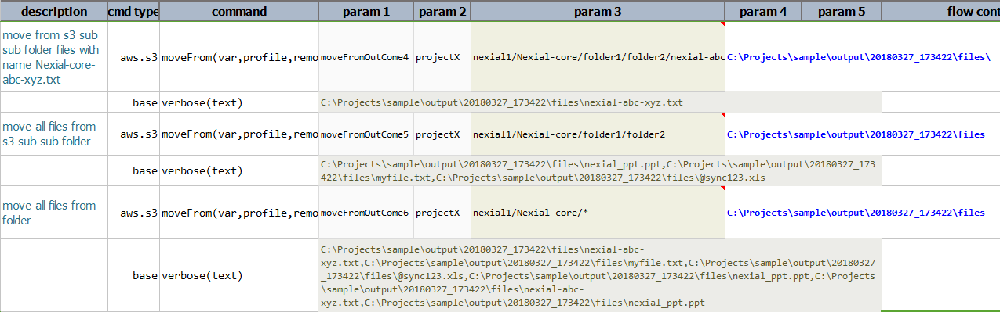

### Description
This command moves all the files matching the criteria specified for the target files from the target bucket/folder 
to the local directory. For example, if the criteria (`remote`) is like `bucket/subdir/*` and the local directory is 
like `C:\projects\ProjectX`, it moves all the files from `bucket/subdir/*` in S3 to the local directory 
`C:\projects\ProjectX`. The **`*`** acts like a wildcard specifying all or none i.e it matches any no. of characters 
in place of `*` or no character at all.

Similarly if the remote is given as `bucket/subdir/data*`, all the files starting with `data` are moved to the 
local directory. Another example is `bucket/subdir/*-*`, where all the files containing `-` are moved to the local 
directory.

However, this command should be applied only on folders having only files and no subfolders in it. Having subfolders 
inside the folder may give incorrect results.

Check [here](index#s3profile) for more information regarding `profile`.

### Parameters
- **var** - the variable name to represent the outcome of this command.
- **profile** - the [profile](index#s3profile) added in the data file which contains AWS credentials and connectivity.
- **remotePath** - the pattern which specifies the folder, file or a pattern of files.
- **local** - the directory to which the files should be copied.

### Example
**Script**: 

**Output**: 

**Script**: 

**Output**: 

### See Also
- [`copyFrom(var,profile,remote,local)`](copyFrom(var,profile,remote,local))
- [`moveTo(var,profile,local,target)`](moveTo(var,profile,local,target))
