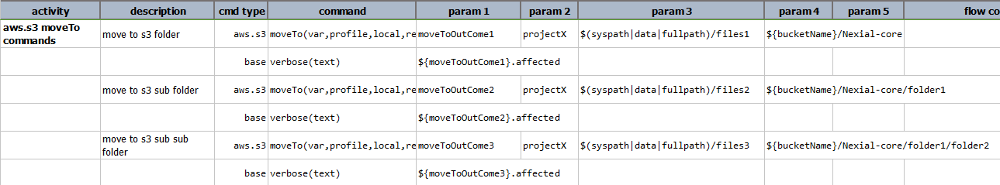
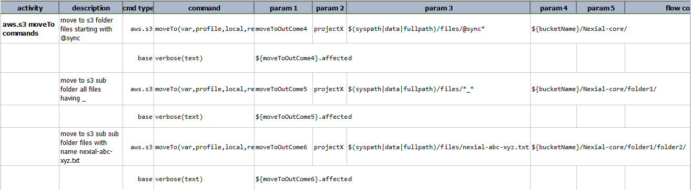
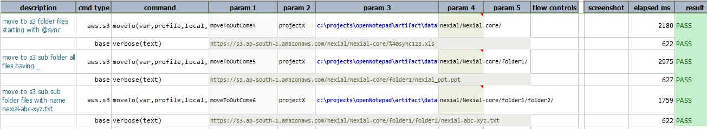

### Description
This command moves all the files matching the criteria specified for the local files from the local source directory 
to the target s3 bucket folder. For example, if the criteria(value of the parameter local) is like 
`c:\projects\my_folder\*` and the target is like `my_folder/projects`, it moves all the files from the local directory 
to the target folder. The **`*`** acts like a wildcard specifying any or none i.e it matches any no. of characters 
in place of `*` or no character at all.

Similarly if the local is given as `C:\projects\ProjectX\test*`, all the files in the `C:\projects\ProjectX\` 
directory with `test` as the starting name will be moved to the target directory. Another example is 
`C:\nexial\test\*_*.txt` moves all the text files containing `_` as part of its name.

However, this command should be applied only on local directories having only files and no subdirectories in it. 
Having subdirectories inside the directory may give incorrect results.

### Parameters
- **var** - the variable name to represent the outcome of this command.
- **profile** - the [profile](index#s3profile) added in the data file which contains AWS credentials and connectivity.
- **local** - the pattern which specifies the directory, file or a pattern of files.
- **target** - the bucket or the bucket folder where to copy the files.

### Example
**Script**: 

**Output**: 

**Script**: 

**Output**: 

### See Also
- [`copyTo(var,profile,local,target)`](copyTo(var,profile,local,target))
- [`moveFrom(var,profile,remote,local)`](moveFrom(var,profile,remote,local))
