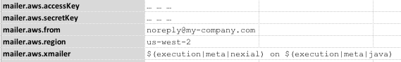

SES, or Simple Email Service, is a cloud service provided by Amazon AWS.  One can utilize such service to send, receive
and manage email activities in the cloud.  Currently Nexial supports the use of SES for sending email to one or more 
recipients (to, cc, or bcc). The email content can be either HTML or plain text.



In addition, the following connection configuration should be considered as well:

|data variable                       |value                                                          | note                                                    |
|------------------------------------|---------------------------------------------------------------|---------------------------------------------------------|
|`<profile>.aws.from`                |The "from" address for each email sent via this profile        |(REQUIRED) A valid email address (not necessarily a valid email account)|
|`<profile>.aws.cc`                  |The "cc" address(es) for each email sent via this profile      |Multiple email addresses are separated by [`nexial.textDelim`](../../systemvars/index#nexial.textDelim)|
|`<profile>.aws.bcc`                 |The "bcc" address(es) for each email sent via this profile     |Multiple email addresses are separated by [`nexial.textDelim`](../../systemvars/index#nexial.textDelim)|
|`<profile>.aws.replyTo`             |The "reply-to" address(es) for each email sent via this profile|If supplied, this is the "reply to" email address(s). If not, the `to` address will be assumed. Multiple email addresses are separated by [`nexial.textDelim`](../../systemvars/index#nexial.textDelim)|
|`<profile>.aws.configurationSetName`|The SES rules to apply on sending emails                       |<a href="https://docs.aws.amazon.com/ses/latest/DeveloperGuide/using-configuration-sets.html" class="external-link" target="_nexial_external">Using Amazon SES Configuration Sets</a>|
|`<profile>.aws.xmailer`             |The extra "tag line" at the end of each email sent             |Useful to provide contextual information regarding the email content. For example, one could add `$(execution|script|name) on $(execution|meta|nexial)` as a "X-Mailer" to indicate where the email is sent from (i.e. which script and with which version of Nexial)|

 

For example, suppose we have a "profile" named as `mailer`: 

Shown above, `mailer` will be used as a "profile" throughout the "aws.ses" commands for SES-related automation.

**NOTE**: 
1. Consider using [nexial-crypt](../../userguide/BatchFiles#nexial-crypt) to encrypt your access
   key and secret key information.
2. It is possible to create multiple profiles and use them selectively during execution.

The "aws.ses" command type represents a series of commands regarding AWS SES.

### Available Commands
- [`sendHtmlMail(profile,to,subject,body)`](sendHtmlMail(profile,to,subject,body))
- [`sendTextMail(profile,to,subject,body)`](sendTextMail(profile,to,subject,body))
