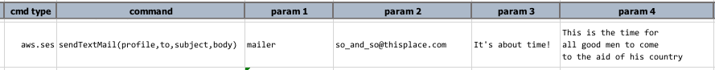
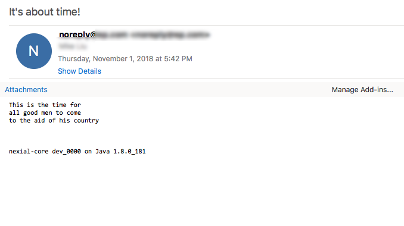

### Description
This command automates the sending of text (i.e. `plain text`) email via AWS SES. The setting up of a "profile" is 
pre-requisite for this command work. Visit [Connection Setup](index#connection-setup) for more details on setting a 
"profile" specific to AWS SES.

It is entirely possible to embed data variables via the standard `${...}` convention in both the `subject` and `body`
parameter. The `to` parameter represent the email recipient(s), each separated by 
[`nexial.textDelim`](../../systemvars/index#nexial.textDelim).  Last, the `body` parameter can represent either text 
or a file with which its content will be used as email body.

### Parameters
- **profile** - the [profile](index#connection-setup) added in the data file which contains AWS SES credentials and 
  connectivity.
- **to** - one or more recipients to receive this email. Multiple addresses are separated by 
  [`nexial.textDelim`](../../systemvars/index#nexial.textDelim).
- **subject** - the email subject line. All recipients will receive the same email subject line.
- **body** - the email body which all recipients will receive.  The content is assumed as plain text. Also, it is 
  possible to use the **[`$(projectfile)`](../../functions/$(projectfile))** built-in variable to pull in email 
  content from a file. Token replacement will be in effect.

### Example
**Script**: 

**Email received**: 

Note that the line breaks are kept as is, and an additional line added to the end of the email.  The additional tag
line is configured through the _optional_ `xmailer` configuration:

### See Also
- [`sendHtmlMail(profile,to,subject,body)`](sendHtmlMail(profile,to,subject,body))
- [mail &raquo; `send(profile,to,subject,body)`](../mail/send(profile,to,subject,body))
- [AWS SES Setup](index#connection-setup)
