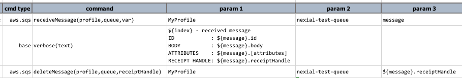

### Description
Delete a message from a SQS `queue` using the specified `profile`. In order to delete a SQS message, the associated
receipt handle must be specified. See [`receiveMessage(profile,queue,var)`](receiveMessage(profile,queue,var)) or 
[`receiveMessages(profile,queue,var)`](receiveMessages(profile,queue,var)) to understand how to obtain the appropriate 
receipt handle.

### Parameters
- **profile** - the [profile](index#connection-setup) added in the data file which contains AWS SES credentials and 
  connectivity.
- **queue** - the target SQS queue name. 
- **receiptHandle** - to identify the message to delete. The receipt handle can be found from the message retrieved 
  from [`receiveMessage(profile,queue,var)`](receiveMessage(profile,queue,var)) or 
  [`receiveMessages(profile,queue,var)`](receiveMessages(profile,queue,var)) command.

### Example

The above example retrieves a message from the `nexial-test-queue` queue, prints out the message details, and then
deletes the same message via its `.receiptHandle`.

### See Also
- [`receiveMessage(profile,queue,var)`](receiveMessage(profile,queue,var))
- [`receiveMessages(profile,queue,var)`](receiveMessages(profile,queue,var))
- [`sendMessage(profile,queue,message,var)`](sendMessage(profile,queue,message,var))
