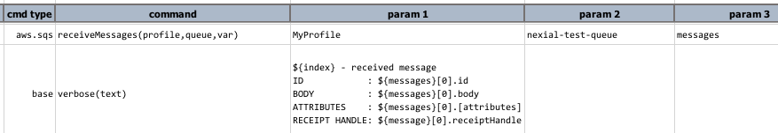

### Description
The command instructs Nexial to receive a list of available messages - up to 10 - from an SQS `queue` and store such 
message objects in a data variable denoted as `var`.

Depending on the `.aws.waitTimeMs` value, Nexial might not return any messages. In such case, the data variable denoted
as `var` will be removed to avoid any confusion with previously retrieved messages. It is also possible that Nexial
might not return all available messages via the same command invocation. Both 
<a href="https://docs.aws.amazon.com/AWSSimpleQueueService/latest/SQSDeveloperGuide/sqs-visibility-timeout.html" 
class="external-link" target="_nexial_external">Amazon SQS Visibility Timeout</a> and message queue size both can have
impact in this.



### Parameters
- **profile** - the [profile](index#connection-setup) added in the data file which contains AWS SES credentials and 
  connectivity.
- **queue** - the target SQS queue name. 
- **var** - the variable to store the retrieved message from this command.

### Example

The above example retrieves messages from the `nexial-test-queue` queue and prints out the message details.

Suppose this message contains an attribute named "create date". To retrieve such information, one would use 
`${messages}[0].[attributes].[create date]`.

### See Also
- [`deleteMessage(profile,queue,receiptHandle)`](deleteMessage(profile,queue,receiptHandle))
- [`receiveMessage(profile,queue,var)`](receiveMessage(profile,queue,var))
- [`sendMessage(profile,queue,message,var)`](sendMessage(profile,queue,message,var))
