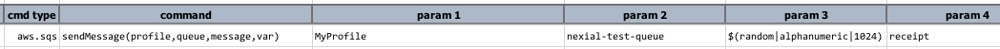

### Description
This command instructs Nexial to send a `message` to a SQS `queue` using the specified 
[profile](index#connection-setup) denotes as `profile`. The outcome of this action is stored in a data variable 
named as `var`.

A SQS message sent via Nexial is automatically added 4 additional message attributes:
- `nexial.sendTimestamp` - the timestamp of when a message is sent from Nexial, in 
   <a href="https://en.wikipedia.org/wiki/Unix_time" class="external-link" target="_nexial_link">epoch</a> format.
- `nexial.version` - the current version of Nexial.
- `nexial.os.user` - the username that executes the current Nexial execution (hence the user that send the message).
- `nexial.os.hostname` - the hostname of the compute resource where Nexial is executed (or where the message is sent).

The outcome of this command is stored in `var`, with the following properties:
- `.id` - the message id.
- `.sendTimestamp` - the timestamp of when a message is sent from Nexial, in 
  <a href="https://en.wikipedia.org/wiki/Unix_time" class="external-link" target="_nexial_link">epoch</a> format.

### Parameters
- **profile** - the [profile](index#connection-setup) added in the data file which contains AWS SES credentials and 
  connectivity.
- **queue** - the target SQS queue name. 
- **message** - the message body to sent. AWS SQS allows only up to 256 KB of content per call. 
- **var** - the variable to store the outcome of this command.

### Example

### See Also
- [`deleteMessage(profile,queue,receiptHandle)`](deleteMessage(profile,queue,receiptHandle))
- [`receiveMessage(profile,queue,var)`](receiveMessage(profile,queue,var))
- [`receiveMessages(profile,queue,var)`](receiveMessages(profile,queue,var))
