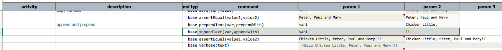

### Description
This command append text denoted by `appendWith` to the end of the text represented by `var` and save it back to `var`.

### Parameters
- **var** - the variable whose text will be appended by `appendWith`
- **appendWith** - the text to append

### Example
Here's an example on how to use this command:

The output shows the appended text (`var1`):

### See Also
- [`prependText(var,prependWith)`](prependText(var,prependWith))
