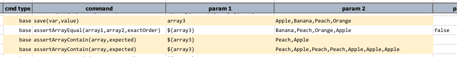

### Description
This command asserts that all the items in `expected` exist in `array`. The parameter `expected` can either be a single 
item or multiple items separated by [`nexial.textDelim`](../../systemvars/index#nexial.textDelim), as the case 
for `array`.  The items in `expected`, should there be multiple, may contain duplicates - Nexial will resolve such 
issues behind the scene.  However the assertion is performed upon each item in `array` **case-sensitively**.

### Parameters
- **array** - the list of items to check
- **expected** - the list of items that MUST exists in `array`

### Example

### See Also
- [`assertArrayEqual(array1,array2,exactOrder)`](assertArrayEqual(array1,array2,exactOrder))
- [`assertArrayNotContain(array,expected)`](assertArrayNotContain(array,expected))
