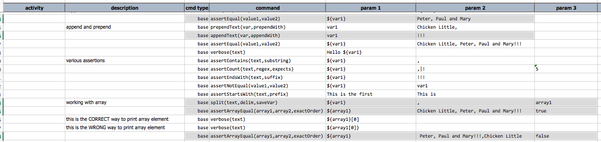
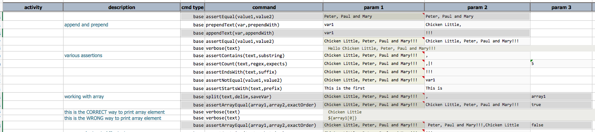

### Description
This command checks that `array1` and `array2` contains the same elements. If `exactOrder` is set to `true`, then 
Nexial will also check that both arrays contain the same elements in the same order. Note that this command 
internally uses the `${nexial.textDelim}` system variable to parse text string into array.

### Parameters
- **array1** - the list of elements to check
- **array2** - the other list of elements to check
- **exactOrder** - indicate whether order is important during array comparison 

### Example
Example on how to use this command (the highlighted rows as guide): 

... the output: 

### See Also
