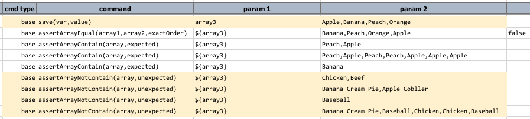

### Description
This command asserts that all the items in `unexpected` DO NOT exist in `array`. The parameter `unexpected` can either 
be a single item or multiple items separated by [`nexial.textDelim`](../systemvars/index#nexial.textDelim), as the case 
for `array`.  If the items in `unexpected` contains duplicates - Nexial will resolve such issues behind the scene.  
However the assertion is performed upon each item in `array` **case-sensitively**.

### Parameters
- **array** - the list of items to check
- **unexpected** - the list of items that MUST NOT exists in `array`

### Example

### See Also
- [`assertArrayEqual(array1,array2,exactOrder)`](assertArrayEqual(array1,array2,exactOrder))
- [`assertArrayContain(array,expected)`](assertArrayContain(array,expected))
