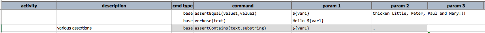
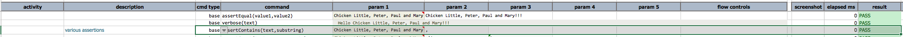

### Description
This command checks that `substring` can be found in its entirety within `text`. This means `substring` can be 
either in the beginning, the ending or the middle of `text`.

### Parameters
- **text** - the text to be tested
- **substring** - the string of characters that should exist within `text`

### Example
Here's an example: 

And, the **output**: 

### See Also
- [`assertStartsWith(text,prefix)`](assertStartsWith(text,prefix))
- [`assertEndsWith(text,suffix)`](assertEndsWith(text,suffix))
