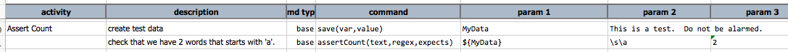
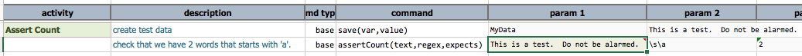

### Description
This command checks that the specified `text` contains the expected number (`expects`) of occurrence as specified 
via `regex`. In other words, Nexial will evaluate `text` with the specified `regex` and ensure that the match count 
is exactly the same as `expects`.   

If `text` is specified via the `${...}` syntax, Nexial internally will handle the appropriate conversion if the 
target variable represents an array, a list, a map or a Java object.

### Parameters
- **text** - the text (can be referenced via `${...}` syntax) that will be evaluated. 
- **regex** - the regular expression to evaluate `text.`
- **expects** - the expected number of matches when evaluating `text` against `regex`.

### Example
Below is a test script that uses `assertCount(text,regex,expects)` 

Here's the **Output**: 

### See Also
- [`saveReplace(text,regex,replace,resultVar)`](saveReplace(text,regex,replace,resultVar))
- [`saveMatches(text,regex,saveVar)`](saveMatches(text,regex,saveVar))
