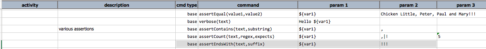

### Description
This command checks that `text` ends with the specified `suffix`. Note that if `text` and `suffix` are both 
equivalent (or empty), this command will consider as pass.

### Parameters
- **text** - the text to test on.
- **suffix** - the specified string of characters to be either the same or found in the end of `text` 

### Example

### See Also
- [`assertContains(text,substring)`](assertContains(text,substring))
- [`assertStartsWith(text,prefix)`](assertStartsWith(text,prefix))
