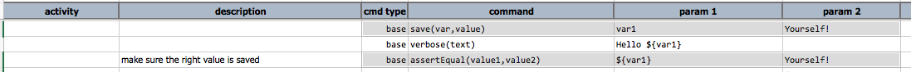
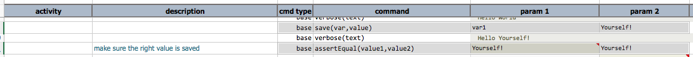

### Description
This command compares 2 text together, character by character. It returns `true` if both text are equivalent.

### Parameters
- **expected** - the first value in this comparison
- **actual** - the second value in this comparison

### Example
Example of this command: 

... output: 

### See Also
- [`assertNotEqual(value1,value2)`](assertNotEqual(value1,value2))
