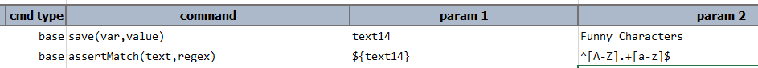

### Description
Use this command to assert that `text` matches entirely to the specified `regex`. More specifically, the content of
`text` is evaluated in its entirety against the specified `regex`.

### Parameters
- **text** - the content to evaluate
- **regex** - the regular expression to evaluate against `text`

### Example
Example of this command: 

### See Also
- [`assertContains(text,substring)`](assertContains(text,substring))
- [`assertEqual(expected,actual)`](assertEqual(expected,actual))
- [`assertNotEqual(value1,value2)`](assertNotEqual(value1,value2))
