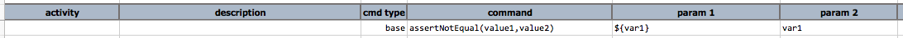
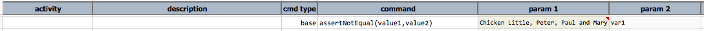

### Description
This command checks that `value1` is not the same as `value2` by comparing their textual 
representation, character by character.

### Parameters
- **value1** - the first text to compare
- **value2** - the second text to compare

### Example
Here's an example how to use this command:

`${var1}` is **not the same** as `var1`:

### See Also
- [`assertEqual(expected,actual)`](assertEqual(expected,actual))