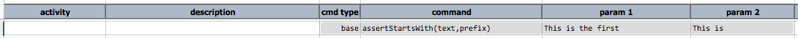



### Description
This command checks that `text` starts with `prefix`. Note that this command returns true if `text` is exactly the 
same as `prefix`, similarly with both `text` and `prefix` are empty.

### Parameters
- **text** \- the text to be checked
- **prefix** \- the text that should be in the beginning of `text` or the same as `text`.

### Example
Script: 

### See Also
- [`assertContains(text,substring)`](assertContains(text,substring))
- [`assertEndsWith(text,suffix)`](assertEndsWith(text,suffix))
