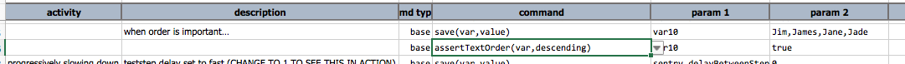
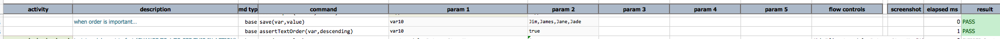

### Description
This command checks that the array represented by `var` is in ascending or descending order. Set `descending` to 
`true` to force descending order check. This command expects `var` to represent an array, and will fail if such is 
not the case.

### Parameters
- **var** - the variable that represents the array in question
- **descending** - `true` if Nexial should check that the array is in descending order. Otherwise Nexial will check 
  in ascending order.

### Example
Here's an example: 

And the output: 

### See Also