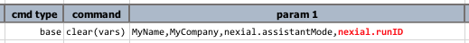

### Description
This command instructs Nexial to remove one or more data variables (`vars`) from current execution.  This will have
no impact to the scripts or data files since Nexial is only clearing out the specified data variable in memory.

Nexial does not fail the execution of this command if the specified data variable does not exist.  So in all likelihood
this command should always PASS.

This command is useful in the following scenarios:
- **Control memory footprint during execution**.  
  At times, one might be automating the processing of a large data set (such as, more than 100k rows).  If memory 
  footprint is a concern, one can use this command to remove the data variable that correspond to this larget data 
  set, which would effectively prevent the memory consumption during execution to grow out of control.
- **Reset execution state**.  
  At times, one may use the value of a known data variable to represent a specific condition or a specific stage of 
  the entire automation.  In order to simulate the "BEFORE" state, one may need to remove (or clear) the data variable 
  in question.
- **Avoid Conflict/Confusion**.  
  Data variable maybe reused or re-declared across multiple scripts, but at times unintentionally. This can be 
  especially problematic for integration testing when scripts from different projects are combined (via test plan) 
  into an end-to-end test suite.  To avoid conflict or confusion with the use of similarly named data variables, 
  one may want to forcefully clear out certain data variables prior to completing a script or a scenario.
  
**Note**:
- Executing [base &raquo; `save(var,value)`](save(var,value)) with `value` as `(empty)` is effectively the 
  same as executing this command.  However this command allows for multiple variables to be specified, and presents a 
  clearer intention.
- If the specified data variable is one that was specified via `project.properties` or at runtime (via `-D` syntax),
  it will likewise be removed.  However, this will only impact current execution.
- Some data variables and System properties cannot be cleared as such would have direct impact to the stability of 
  a Nexial execution.  See [System Variable](../../systemvars/index) for more details.

### Parameters
- **vars** - one or more data variable to be cleared (removed), separated by [`nexial.textDelim`](../../systemvars/index#nexial.textDelim)

### Example

Since [`nexial.runID`](../../systemvars/index#nexial.runID) is a READ ONLY system property, the intention to clear 
it will be ignored.  Other data variables will be cleared.

### See Also
- [base &raquo; `save(var,value)`](save(var,value))
