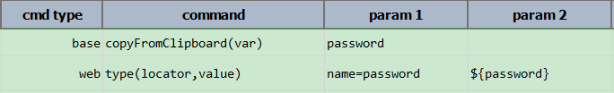

### Description
This command instructs Nexial to save/overwrite a variable with the clipboard value. This works like [`save(var,value)`](save(var,value)) only difference is that we don't have to supply value, it will take value form clipboard. For example, if we have "xyz" in our clipboard it will be copied into provided variable name.

### Parameters
- **var** - the variable name to save the clipboard value

### Example

Above script showing how to use `copyFromClipboard` command.

### See Also
- [`clearClipboard()`](clearClipboard())
- [`copyIntoClipboard(text)`](copyIntoClipboard(text))