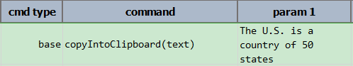

### Description
This command instructs Nexial to save/overwrite the clipboard with the specified value.

### Parameters
- **text** - the value will be copied into clipboard

### Example

### See Also
- [`clearClipboard()`](clearClipboard())
- [`copyFromClipboard(var)`](copyFromClipboard(var))