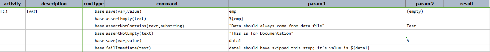

### Description
This command simply stop the test execution with a FAIL.  One can use `text` to provide additional 
information/justification to fail-immediate.

One practical reason to use this command would be the need to terminate the test execution due to 
landing of certain unfavorable condition such that the continuation of such execution would either 
be irrelevant, unstable or contradictory to the intent of the test.

### Parameters
- **text** - information/reason for the immediate fail.

### Example
**Script**: 

**Output**: 

#### See Also
