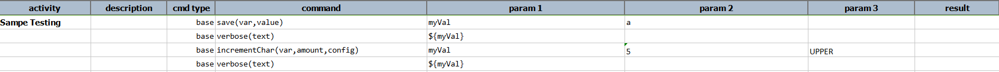
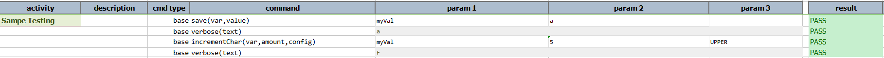

### Description
This command increments value of `var`, using one of the support strategy (more below).  This is useful when a 
non-numeric increment is needed during automation.  For example, suppose the following test steps:

  1. open "page X"
  2. there should be 15 items listed, with each item labelled by an alphabet starting with 'A'.
  3. validate that the list contains the right sequence of letters (i.e. 'A', 'B', 'C', ...)

Since the number of items can be dynamic, we shouldn't hard code the list of alphabet to validate.  Instead we can use
this command to increment from one letter to the next.

##### Increment Strategy
Currently Nexial provides 3 approaches to increment:
- ALPHANUM: This will increment `var` according to the following sequence:
  `0123456789ABCDEFGHIJKLMNOPQRSTUVWXYZabcdefghijklmnopqrstuvwxyz`
- UPPER: This will convert, if necessary, the value of `var` to UPPERCASE, and increment it to the appropriate alphabet.
- LOWER: This will convert, if necessary, the value of `var` to lowercase, and increment it to the appropriate alphabet.

### Parameters
- **var** - the data variable whose value is to be incremented  
- **amount** - the amount of increment to perform
- **config** - the increment strategy (above) to apply: `ALPHANUM`, `UPPER` or `LOWER`

### Example
**Script**: 

**Output**: 

### See Also
- [`increment(var,amount)`](../number/increment(var,amount))
