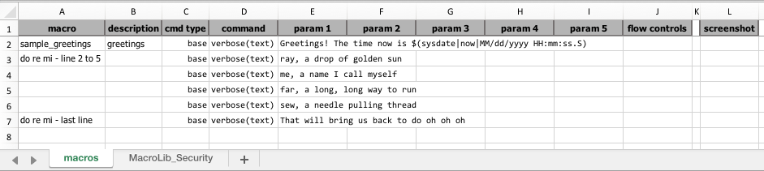
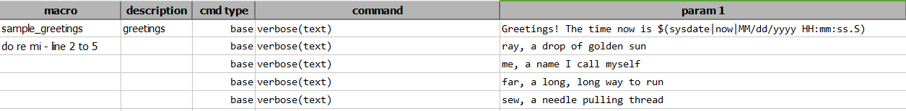
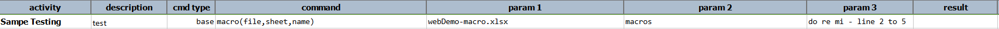
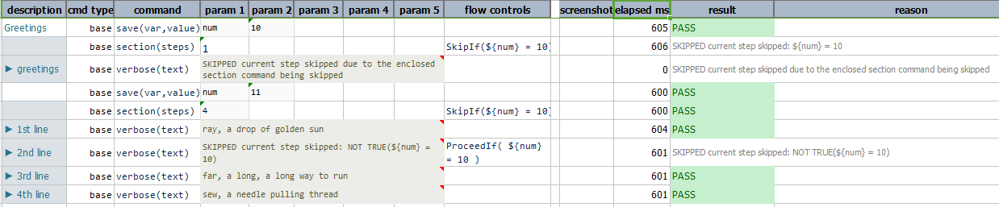

### Description
The main idea with macro is to enable the reuse of a set of test steps. Not only the reuse of the scripting effort, 
but this technique also helps with the reuse of execution. This helps to create uniformity in the execution of common
steps. **Macro command is converted to [base &raquo; `section(steps)`](section(steps)) command during execution.**

This command includes a set of test steps that are kept within a "macro script" (more below) and execute them as part
of the execution. One may think of this as a form of "in-place expansion". 

[base &raquo; `section(steps)`](section(steps)) is extension of macro command. Section command evolved from the idea 
of having finer control over the execution flow of macro and the imported steps of a macro.

### How it is converted to section
Nexial converts macro command to [base &raquo; `section(steps)`](section(steps)) during execution. Let's walk through 
its process:
1. First, Nexial retrieves a set of reusable steps from parameters of macro command.
2. Replacing [base &raquo; `macro(file,sheet,name)`] command with [base &raquo; `section(steps)`] where `steps` is 
   the number of macro steps (i.e reusable steps).
3. Then the steps from the corresponding macro file added as subsequent steps in enclosing script file.
4. Then Nexial proceed to execute the [base &raquo; `section(steps)`](section(steps)) and the imported steps as it 
   normally does.
5. Output for section command converted from macro is styled differently to give better visual against normal steps.
 

### Macro script
**Template of macro script:**
1. The macro look similar to that of a Nexial script. It contains the same basic structure of script template, 
   like this: 
    
2. As you can see macro script don't have first three rows of script template. Also it has first column as `macro` 
   instead of `activity`.
3. You can get macro script template at **"${NEXIAL_HOME}/template"**. NEXIAL_HOME is the location where 
   [Nexial is installed](../../userguide/InstallingNexial.md).

In the depiction above, there are 3 sets of macros:
1. "sample_greetings": Row 2
1. "do re mi - line 2 to 5": Row 3 through 6
1. "do re mi - last line": Row 7

Collectively these are placed within a worksheet called "macros" (can be any name of your choosing), which one can 
think of such as a collection or "macro library".

Hence this is the basic anatomy of a "Macro script":
- **Macro script** - the file or the workbook - represents a collection of macro libraries
- **Macro library** - the worksheet - represents a collection of macros which can be independently invoked
- **Macro** - one or more Excel rows - represents one or more test steps

It is important to note that there should be **no blank rows within a macro library**. Nexial will stop parsing when a 
row is found without a command being specified.

Also, one should be aware that while the test steps within a macro are uniform across invocation, the corresponding
test data need not be so. Indeed, the calling script and its corresponding data file can contain different test data
value for the same macro, and thus extend further flexibility.

### Parameters
- **file** - refers to the macro file name (ideally residing in the same location of the calling script)
- **sheet** - refers to the worksheet that contains the target set of test steps
- **name** - refers to the specific macro name, which in turn refers to a set of reusable test steps 

### Example
**Macro file**: 

**Script calling macro**: 

**Output**: 

### See Also
- [`section(steps)`](section(steps))
