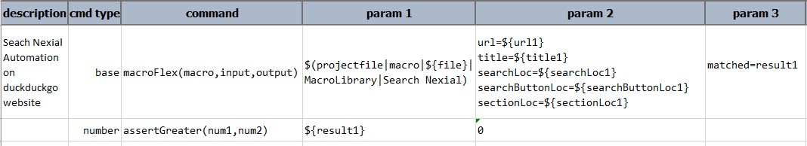
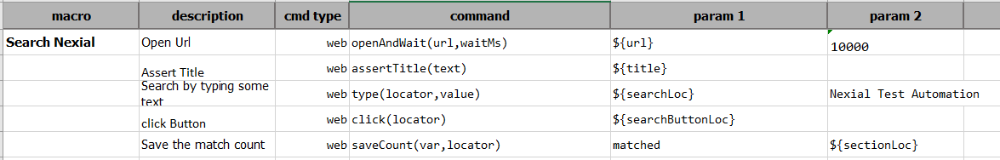
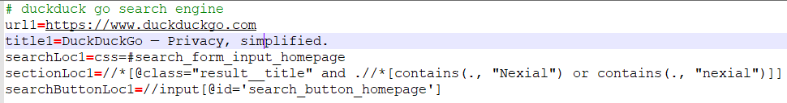
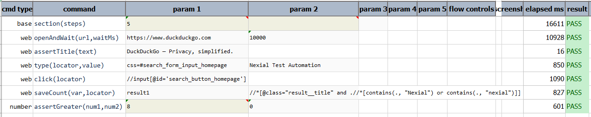

### Description
The main idea with macroPlus command is to provide extension to **[base &raquo; `macro(file,sheet,name)`](macro(file,sheet,name))**
where user can pass data to scoped variables of macro steps from calling scripts which are only accessible within 
macro steps, also data results to be passed back from invoked macro as well.

User would be able to pass zero to more input arguments to macro steps or can pass output variables from target macro to
invoking script when macro execution completes. Just like macro command, this command includes a set of test steps that 
are kept within a "macro script" and execute them as part of the execution. For more details, go through 
**[base &raquo; `macro(file,sheet,name)`](macro(file,sheet,name))**. 

#### Note
1. The main benefit is that one can use same macro at multiple places in script by passing different 
variable values to the scoped variable.
2. User can invoke macro at the runtime during Nexial execution by changing macro details as such file name, sheet 
name or even macro name.

### Parameters
- **macro** - refers to the macro details such as macro file, sheet and name which would be provided by built-in function 
 [`$(projectfile|macro)`](../../functions/$(projectfile))
- **input** - refers to the one or multiple input arguments in the `key=value` pair which is separated by new line
              character (`\n`). In this case, `key` will be scoped variable to which `value` will be passed. 
- **output** - refers to the one or multiple output arguments in the `key=value` pair which is separated by new line
               character (`\n`). `value` will be data variable name to which content of another variable(`key` here) 
               is saved. 

### Example
In below example, this macro accepts values for `url`, `title`, `searchButtonLoc` and `sectionLoc`. Also, it passes 
result data values back to script like `matched` to `result1` in this example. So `matched` will be variable which 
will be accessible within this macro only. Also, by the way, user can pass multiply values separated by
new line character(`\n`). 

**Script** 
 

**Macro** 
 

**Project.properties** 

**Output** 

### See Also
- [`macro(file,sheet,name)`](macro(file,sheet,name))
- [`section(steps)`](section(steps))
