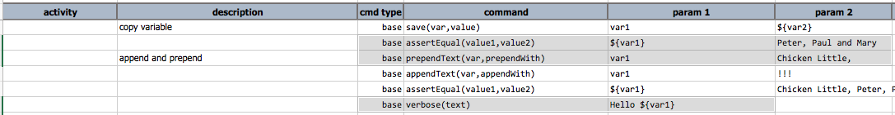
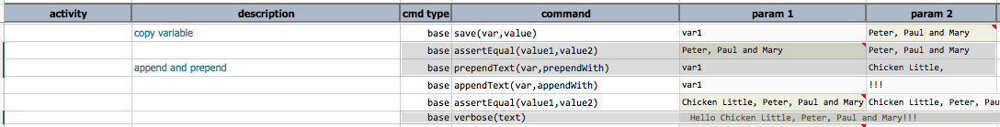

### Description
This command does a few things:
1.  retrieves the text value of `var`
2.  adds `prependWith` to the beginning of this text
3.  saves text back to the same variable `var `

**Note**: if the value represented by `var` is not text (for e.g. array or map), then after this command it will be 
saved as text.

### Parameters
- **var** - the name of the variable who text value will be prepended
- **prependWith** - the text to add to the beginning of the textual value of `var`

### Example
Here's an example on using this command:

output - notice that the last `verbose(text)` command prints out the modified result of `var1`:

### See Also
- [`appendText(var,appendWith)`](appendText(var,appendWith))
