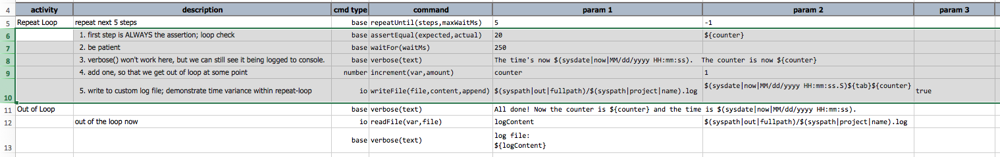
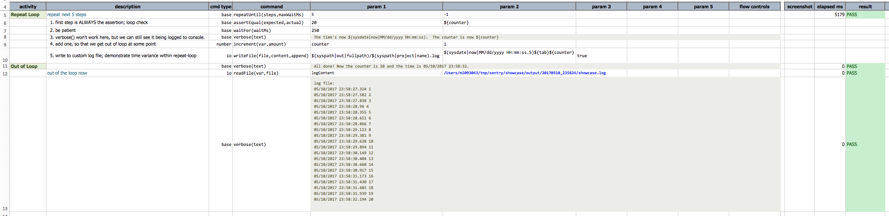

### Description
This command utilizes the execution of one or more subsequent commands to create a repeat-until-desired-result-reached 
behavior. In other words, using this command, one can achieve something like the following:

> Start Loop 
> &nbsp;&nbsp; check condition: Is ConditionA reached? 
> &nbsp;&nbsp;&nbsp;&nbsp;&nbsp;&nbsp; if ConditionA reached, then exit loop 
> &nbsp;&nbsp; if ConditionA not yet reached, stay in the loop and 
> &nbsp;&nbsp;&nbsp;&nbsp;&nbsp;&nbsp; perform TaskA 
> &nbsp;&nbsp;&nbsp;&nbsp;&nbsp;&nbsp; perform TaskB 
> &nbsp;&nbsp;&nbsp;&nbsp;&nbsp;&nbsp; ... 
> &nbsp;&nbsp; back to the beginning of the loop

One can perform a series of commands within the repeat-until execution, such as evaluate a SQL execution, wait for 
certain time, check for specific text or state of a web page or application.

**A few things to note**:
1. Performing repetitions within a test scenario cause complication to the output format/file. As such, all command 
   assigned for a repeat-until execution will not be updated in the corresponding Nexial output file. One can 
   circumvent this issue by creating customize logs (show in Example below).
2. **First command MUST BE an assertion** (validation). In other words, any command that starts with `assert`. It 
   is this first command that will be used to evaluate the need to continue the repeat-until execution or to exit 
   from it.
   1. `FAIL` to such assertion means to continue the repeat-until loop
   2. `PASS` to such assertion means to terminate the loop (i.e. the 'until' condition has reached) - the 
   `repeatUntil(steps,maxWaitMs)` command is considered as `PASS`
3. All other commands (besides the first assertion command) within the repeat-until loop is expected to `PASS`
   1. Failure in any of these commands (expect the first) will result in the termination of repeat-until loop - the 
   `repeatUntil(steps,maxWaitMs)` command is considered as `FAIL`
   2. EXCEPT when [`nexial.failFast`](../../systemvars/index.html#nexial.failFast) is set to `false`. The repeat-until 
   loop honors the `nexial.failFast` system variable so that one can "collect-all-failures" rather than 
   "fail-at-first-instance".
   3. To enforce the "fail-at-first-instance" requirement, either
   
      - `set JAVA_OPT=-Dnexial.failFast=true` on command line before running Nexial, OR  
      - add to your datasheet: `nexial.failFast | true`, OR  
      - via command: `base | save(var,value) | nexial.failFast | true`
4. If one wish to limit the timespan such repeat-until execution, the second parameter `maxWaitMs` can be used. 
   However, it must be a value greater than `1000` (i.e. 1 second). Use `-1` if time should not be considered as a 
   constraint (ie. disable time tracking). This is a great way to simulate a time-out condition.
5. The use of [verbose(text)](verbose(text)) will have no impact to the corresponding output file. However the 
			output produced by this command can be observed in the console log.

### Parameters
- **steps** - this parameter specifies the number of subsequent (as in **immediately following**) commands to consider 
		for the repeat-until execution.
- **maxWaitMs** - this parameter specifies the amount of time to wait before consider the repeat-until execution as 
		a failure (i.e. time out). Use `-1` to signify the willingness to wait _forever_.

### Example
Here's an example of how this command can be used: 

Here, we have _recruited_ 5 steps (Row 6 through Row 10) in the repeat-until execution. As stated, the first step 
MUST be an assertion - [`assertEqual()`](assertEqual(expected,actual)). The assertion is "make sure counter 
equal to 20?". Upon the successful validation of this assertion, the loop-until execution will exit (as SUCCESS). 
We use `-1` in the `repeatUntil(steps,maxWaitMs)` command, which is keep looping until the first assertion command is 
successful.

The rest of the commands are self-explanatory, and fairly inconsequential to the context of this page. Here's the 
outcome: 

As stated earlier, there is no result or elapsed time for the steps utilized by the repeat-until execution.

### See Also
