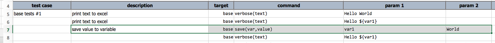

### Description
This command instructs Nexial to save/overwrite a variable with the specified value. If the specified value resolved 
to an empty string, then the specified variable will be deleted.  Practically speaking, variable manipulated through 
this command will almost always save its value as string (text). However, Nexial will apply some logic during the 
retrieval of such variable to the most appropriate data type. For example, saving "1.0" can be treated as numeric 1.0 
or 1 during assertion or comparison.

### Parameters
- **var** - the variable name to save the specified value
- **value** - the value to associate to the specified variable

### Example

Row 7 save the text `World` to a variable named as `var1`. Row 8 retrieves the same variable as part of a longer 
string to product `Hello World`.

### See Also
