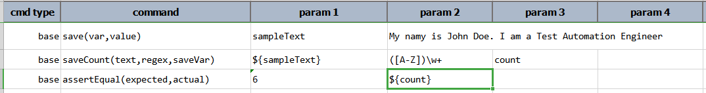
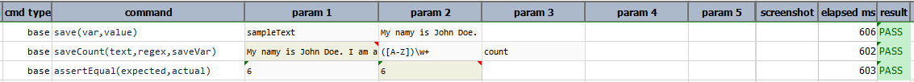

### Description
This command saves the count of matches (based on `regex`) on `text` to a new variable denoted as `saveVar`. In 
another word, Nexial evaluates `text` against `regex`, and then saves the number of matched portion to another variable 
specified as `saveVar`.

### Parameters
- **text** - the text (can be referenced via `${...}` syntax) that will be evaluated.
- **regex** - the regular expression use to evaluate against `text`.
- **saveVar** - the variable name to which the matched portion of `text` will be saved. If no match is found, then 
  nothing will be saved and `saveVar` will be removed.

### Example
Here, we count the number of words which start with a capital letter  
 **Script:** 

  
**Output:** 

### See Also
- [`assertCount(text,regex,expects)`](assertCount(text,regex,expects))
- [`saveMatches(text,regex,saveVarN)`](saveMatches(text,regex,saveVar))
- [`saveReplace(text,regex,replace,resultVar)`](saveReplace(text,regex,replace,resultVar))