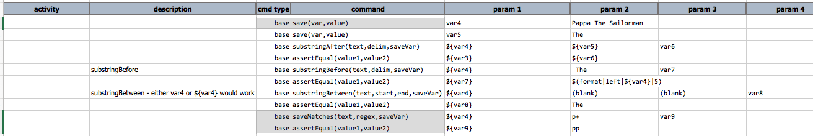
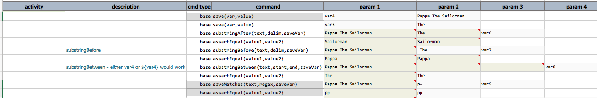

### Description
This command saves the matched portion of `text`, based on `regex`, to a new variable denoted as `saveVar`. In 
another word, Nexial evaluates `text` against `regex`, and then saves the matched portion to another variable 
specified as `saveVar`.

If `text` is specified via the `${...}` syntax, Nexial internally will handle the appropriate conversion if the 
target variable represents an array, a list, a map or a Java object.

### Parameters
- ****text** - **the text (can be referenced via `${...}` syntax) that will be evaluated.
- **regex** - the regular expression use to evaluate against `text`.
- **saveVar** - the variable name to which the matched portion of `text` will be saved. If no match is found, then 
  nothing will be saved and `saveVar` will be removed.

### Example
Here's an example how to use this command: 

The output shows what's being matched and stored: 

### See Also
- [`assertCount(text,regex,expects)`](assertCount(text,regex,expects))
- [`saveReplace(text,regex,replace,resultVar)`](saveReplace(text,regex,replace,resultVar))