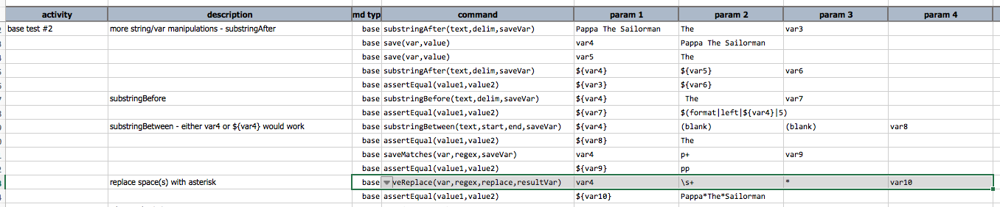
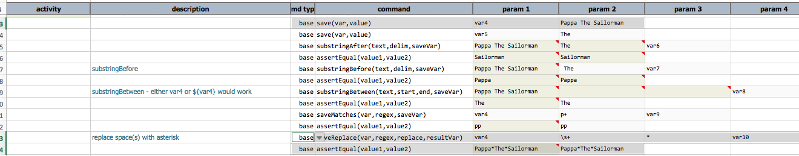

### Description
This command does a number of things:
1. Nexial reads in `text`
2. Nexial matches it against the specified `regex`, and replace all matched portion/region of `text` with the 
   specified text (`replace`)
3. Nexial saves the modified text into a new variable denoted as `resultVar`

If `text` is specified via the `${...}` syntax, Nexial internally will handle the appropriate conversion if the 
target variable represents an array, a list, a map or a Java object. 

### Parameters
- **text** - the text (can be referenced via ${...} syntax) that will be evaluated. 
- **regex** - the regular expression to use for this match and replace operation
- **replace** - the text to replace all the matched region/portion of `text`
- **resultVar** - the name of the new variable to save the replaced text

### Example
Here's an example of this command: 

The output shows the modified text under `var10`: 

### See Also
- [`assertCount(text,regex,expects)`](assertCount(text,regex,expects))
- [`saveMatches(text,regex,saveVar)`](saveMatches(text,regex,saveVar))