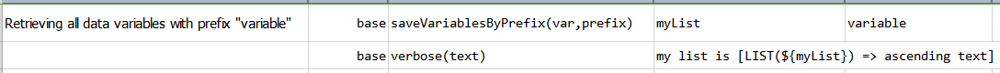

### Description
This command collects all available data variables with name starting as specified `prefix`. The matched data variable
names will be saved as a list under the named specified by `var`.

### Parameters
- **var** - the variable name to save the matching data variable names.
- **prefix** - the prefix with which to match the data variable names.

### Example
Suppose we have the following data variables: 

**Script:** 

**Output:** 
Observe that the extracted variable names as a list.

### See Also
- [`saveVariablesByRegex(var,regex)`](saveVariablesByRegex(var,regex))
