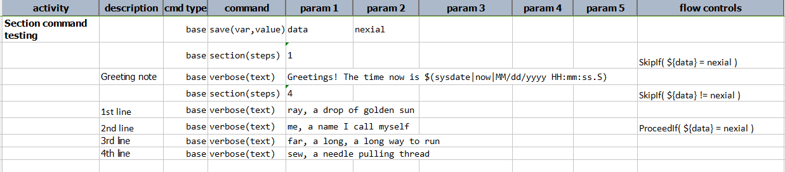
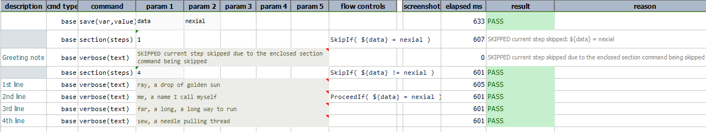

### Description
Section command was designed the idea of having finer control over flow control over an entire macro (or block of 
steps) and over the enclosed individual steps. The main idea with `section` is to execute a set of steps (of the same 
section) with the ability to control the entire section via flow control.

### When to use and why
This command has its own purpose like other nexial commands. This command works well when one wants to modify or change 
execution flow for multiple subsequent commands and for enclosed steps. 

For Example, 
- Let's consider testing of a web application. We will most likely have login and sign up scenarios. We will have one 
  section for login and other for sign up. If we don't have credentials, we have to sign up otherwise directly login 
  to app. So if we do have credentials we need to ignore all sign up section steps. Let's consider next scenario too. 
  The login section will have its own flow controls like if password does not have special character, we will end the 
  automation script directly. In this kind of scenario where we will need particular set of steps to be skipped or in 
  case of multiple flow control, section command can be more useful. It will add more flexibility for use of flow 
  controls.

For better visual for output of subsequent commands in section against normal command, we have different style for 
section command and subsequent command in that section description cell.
1. Section command steps have **►** character in their description cell as a prefix with one space indentation for 
   description. For example if section has 10 steps, description cell of these 10 subsequent commands will have 
   **►** character as a prefix.  
2. Section command and subsequent steps altogether have different color. You can see following output file. 

    
### Parameters
- **steps** - this parameter specifies the number of subsequent (as in **immediately following**) commands to 
  consider in a section.

### Example
**Script**: 

**Output**: 

### See Also
- [base &raquo; `macro(file,sheet,name)`](macro(file,sheet,name))
