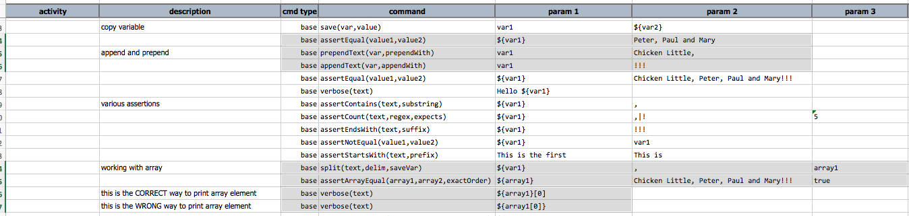
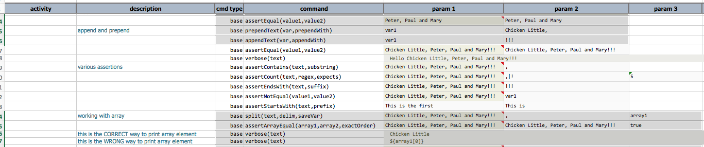

### Description
This command splits `text` by `delim` into an array, which is then saved as a variable denoted by `saveVar`.
If `delim` is omitted, the value of `${nexial.textDelim}` will be used instead. Special care should be taken when 
using variable expansion (ie. `${..}`) if the underlying data is not text (such as a [SQL query result](../rdbms) or 
[HTTP response](../ws))

### Parameters
- **text** - the text to split on
- **delim** - the delimiter to use when splitting `text` into an array/list
- **saveVar** - the variable to save the resulting array

### Example
**Script**: 

output (note the last 2 lines above, how the element of an array can be assessed via the `${...}[i]` syntax):

### See Also
