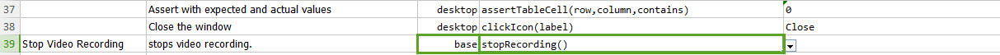

### Description
This command can be used to screening recording an execution.  The recording will capture the entire primary desktop.  
Usage is given in the example section. 

### Example
**Usage**: This command can be used at any step. Recording will be started from that point onward. 
It will be saved in **.avi format** under the **output **directory under **captures** folder. The recorded video can be opened with **Windows Media Player**.

Script:

This command is used in conjunction with **stopRecording()** command. Using this command will stop recording the script.

### See Also

*   [stopRecording()](https://confluence.ep.com/pages/viewpage.action?pageId=9985416)