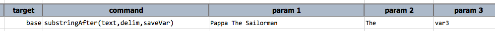

### Description
This command instructs Nexial to save the portion of `text` found after the first occurrence `delim` to a variable 
specified via `saveVar`. For example,

`substringAfter(text,delim,saveVar) | 714-811-0290 | - | variable1`     --\> variable1 = `811-0290`

### Parameters
- **text** - the text to extract from. Variable expansion is supported via the `${...}` syntax
- **delim** - the delimiter to consider, only the first occurrence will be in effect
- **saveVar** - the name of the variable to save the substring

### Example

`var3` contains **`Sailorman`**

### See Also
- [`substringBetween(text,start,end,saveVar)`](substringBetween(text,start,end,saveVar))
- [`substringBefore(text,delim,saveVar)`](substringBefore(text,delim,saveVar))
- [`saveReplace(text,regex,replace,resultVar)`](saveReplace(text,regex,replace,resultVar))
- [`saveMatches(text,regex,saveVar)`](saveMatches(text,regex,saveVar))
- [`split(text,delim,saveVar)`](split(text,delim,saveVar))
- [`prependText(var,prependWith)`](prependText(var,prependWith))
- [`appendText(var,appendWith)`](appendText(var,appendWith))