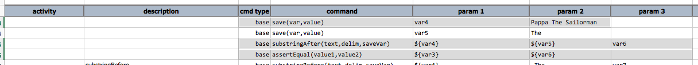
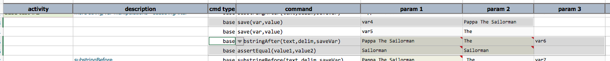

### Description
This command save the portion of `text` that is before `delim` to a variable denoted as `saveVar`.

Note that:
- `delim` must be specified. To denote space, use either the `space` character or `(blank)`.
- If `delim` is not found, then `saveVar` is set to `text`. IOW, the entire content of `text` is saved under the 
  variable named `saveVar`. 
- Only the first occurrence of `delim` is considered.

### Parameters
- **text** - the text where the substring operation is to be performed. Variable expansion is supported via the 
  `${...}` syntax.
- **delim** - the delimiter to use fore extract from `text`. Only first occurrence is considered.
- **saveVar** - the variable to use for saving the result of the substring operation. If `delim` is not found in 
  `text`, then `saveVar` will be saved as `text`.

### Example
**Script**: 

... and the output as follows: 

### See Also
- [`substringAfter(text,delim,saveVar)`](substringAfter(text,delim,saveVar))
- [`substringBetween(text,start,end,saveVar)`](substringBetween(text,start,end,saveVar))
- [`saveMatches(text,regex,saveVar)`](saveMatches(text,regex,saveVar))
- [`saveReplace(text,regex,replace,resultVar)`](saveReplace(text,regex,replace,resultVar))
- [`appendText(var,appendWith)`](appendText(var,appendWith))
- [`prependText(var,prependWith)`](prependText(var,prependWith))