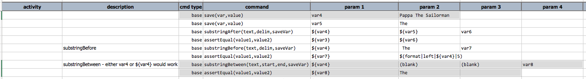
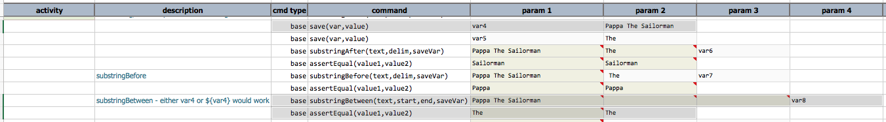

### Description
This command save the characters between `start` and `end` of the specified `text` to the variable denoted as 
`saveVar`.

Note the following:
1. The parameter `start` and `end` must not be empty strings. If you need to use blank, use `(blank)` to denote as 
   such.
2. Parameter `start` will be search first, then `end`. If either delimiter cannot be found, no substring operation 
   will be performed.
3. If no characters can be found between `start` and `end`, or if these delimiters is not found, then the specified 
   `saveVar` will removed.

### Parameters
- **text** - the text where search and substring operations will be performed. Variable expansion is supported via 
  the `${...}` syntax.
- **start** - the character sequence that denote the start of the substring operation
- **end** - the character sequence that denotes the end of the substring operation
- **saveVar** - the variable to use for saving the substring result

### Example
Here's an example script for `substringBetween(text,start,end.saveVar)`: 

... and the output as follow: 

### See Also
- [`substringBefore(text,delim,saveVar)`](substringBefore(text,delim,saveVar))
- [`substringAfter(text,delim,saveVar)`](substringAfter(text,delim,saveVar))
- [`saveReplace(text,regex,replace,resultVar)`](saveReplace(text,regex,replace,resultVar))
- [`saveMatches(text,regex,saveVar)`](saveMatches(text,regex,saveVar))
- [`split(text,delim,saveVar)`](split(text,delim,saveVar))
- [`prependText(var,prependWith)`](prependText(var,prependWith))
- [`appendText(var,appendWith)`](appendText(var,appendWith))