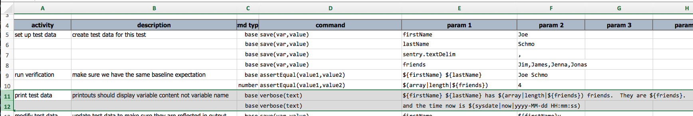
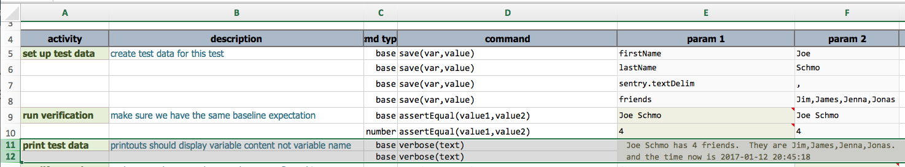

### Description
This command simply prints out the specified `text`, after data variable substitution is complete. No additional 
formatting will be done to the rendered `text`.  All the spaces and newline characters will be kept intact.

However, it is worth noting that Excel poses a limits on the number of characters allowed within one cell. As such, 
it is possible that the entire content of `text` might not be displayed as intended.

### Parameters
- **text** - the text to print. If any variable is specified, substitution will be performed prior to display. 
  Any unresolved variable will be rendered as is.

### Example

Above is a sample test script that utilizes the `verbose(text)` command. A number of variables set up from row 5 
through 7. At row 11 and 12, these variables are used as the parameters for the `verbose(text)` command. The 
output looks like this:

As shown, row 11 now shows `Joe Schmo has 4 friends. They are Jim,James,Jenna,Jonas`, where `${firstName}` and 
`${lastName}` are substituted with the respective values.

Row 12 is a slight variation of the same. Instead of substituting test data, it rendered the built-in `sysdate` 
function.

### See Also
- [`$(sysdate)`](../../functions/$(sysdate))
- [`save(var,value)`](save(var,value))
