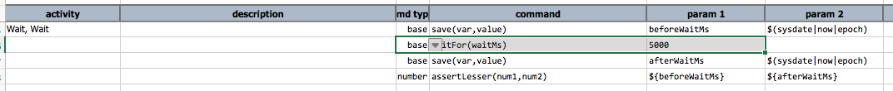
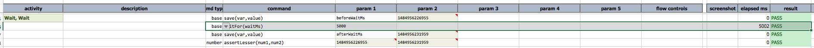

### Description
This command implicitly pauses the test execution for the specified time (in milliseconds).

This is **NOT** a generally advisable strategy for object or workflow synchronization. Instead many of the 
Nexial commands has built-in "wait-for-object" mechanism so there should no need for explicit wait.  In addition, 
user should not expect the wait time to be consistently precise. It is quite common that there might be a few 
milliseconds added to the total wait time, esp. during high load.

### Parameters
- **waitMs** - the number of milliseconds to wait

### Example
Here's the test **Script**: 

And the output shows the time elapsed due to the specified `waitMs`: 

### See Also
