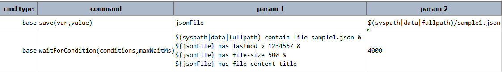
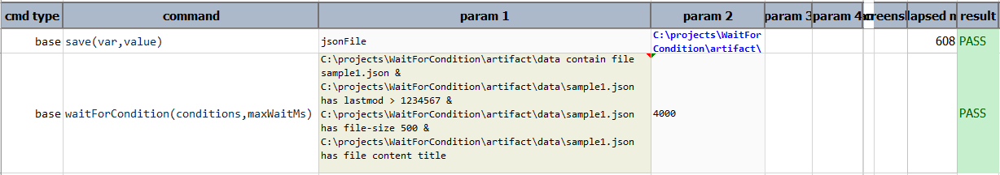

### Description
A new command to automate the checking of a condition or multiple conditions (chained with `&`). This command will allow 
Nexial automation to be more fluid in terms of the classic "wait until some condition, then proceed” requirement. 
For example,
 `base | waitForCondition(conditions,maxWaitMs) | ${my_file} has file-size 250 | 5000`

This means that “a file denoted as `${my_file}` should exist and has at least a file size of 250 bytes within the next 5
seconds”. 
Nexial will continuously check for the above-mentioned condition until `maxWaitMs` time is reached or condition 
satisfied. After `maxWaitMs` time, if all the specified conditions still are not satisfied , then Nexial will consider 
this command as **FAIL**.

This new command uses [`Nexial Filter`](../../flowcontrols/filter) to express the conditions. 

### Parameters
- **conditions** - a single condition or multiple conditions to match till proceeding further. 
- **maxWaitMs** - the max time in milliseconds to wait till timeout.

### Example
The script will check for following conditions to be satisfied until `4000` milliseconds reached:
1. project `data` directory contains `sample1.json`
2. `sample1.json` has last modified greater than `1234567`
3. `sample1.json` has size at least `500` bytes
4. `sample1.json` file content has `title` in it

If all conditions are matched, then it will immediately return `Success` response. Otherwise, it will continuously check
for these conditions until `4000` milliseconds reached.

**Script:** 

**Output:** 

### See Also
- [`Nexial Filter`](../../flowcontrols/filter)
- [`Flow Controls`](../../flowcontrols)
