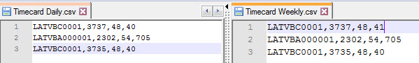
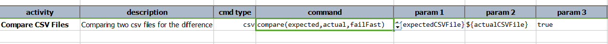
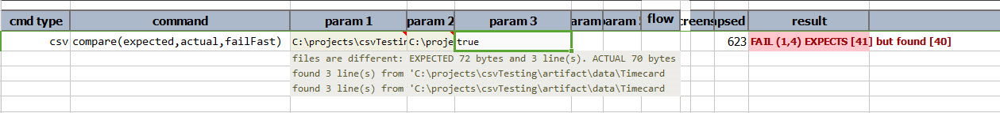

### Description
This command compares two CSV files. It compares the file size (in bytes) and the content of the files. 

**NOTE THAT THIS COMMAND IS FUNCTIONALLY THE SAME AS 
[io &raquo; `compare(expected,actual,failFast)`](../io/compare(expected,actual,failFast)). Check its 
[documentation](../io/compare(expected,actual,failFast)) for more details.**

### Parameters
- **expected** - the expected csv file or CSV content
- **actual** - the actual csv file or CSV content
- **failFast** - if `true`, it will fail upon the first mismatch and stop further comparison of the content. 
  If `false`, it will compare content in entirety.

### Example
Test Data: 

**Script**: 

**Output**: failure on first line and fourth string 

### See Also
- [io &raquo;`compare(expected,actual,failFast)`](../io/compare(expected,actual,failFast))
