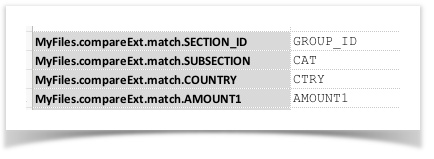
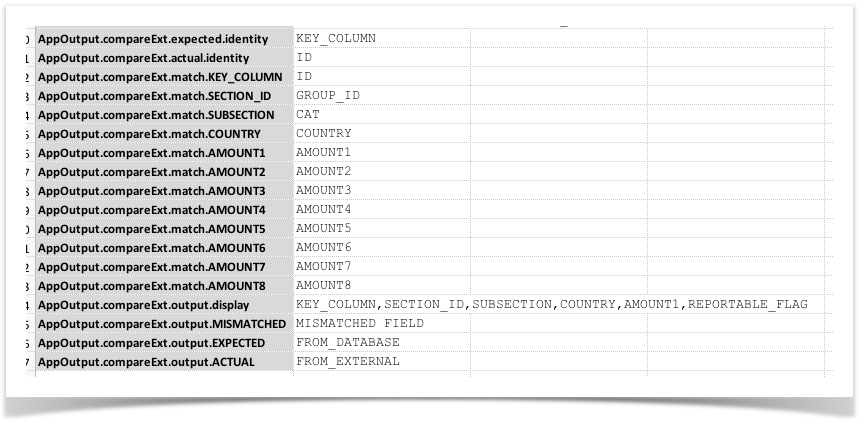
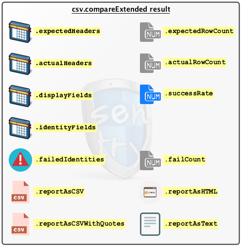
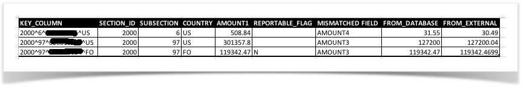
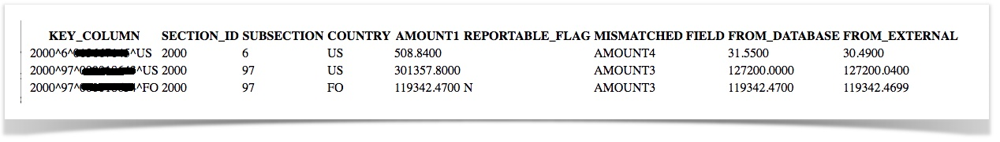
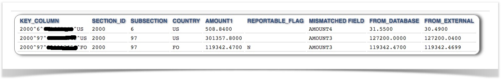
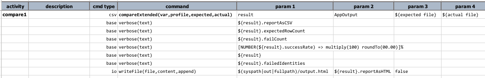
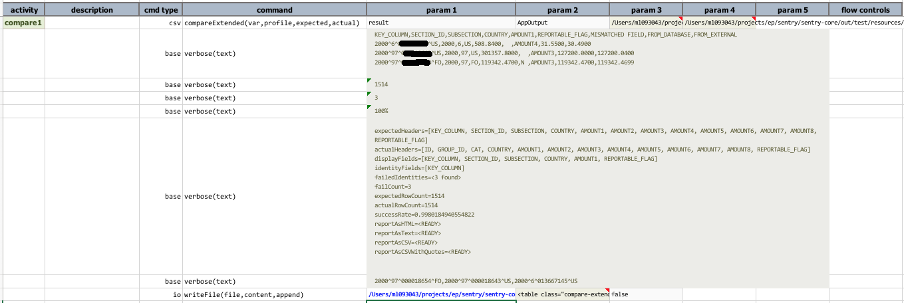

### Description
This command provides a more comprehensive way of comparing CSV content.  For simple comparison, check out 
[`compare(expected,actual,failFast)`](compare(expected,actual,failFast)).

The main purpose of this command is to provide flexibility and insights into the comparison of 2 CSV content with the 
following strategies:
- Ability to compare 2 fields with different name, and possibly different position in the respective files
- Ability to skip certain fields, but still have them as part of output
- Ability to compare files with disparate sort order
- Ability to specify multiple columns as "identity" columns for fast comparisons
- Ability to generate different format of output, such as CSV and HTML
- Ability to control the fields to display as part of output
- Ability to create reusable configuration for comparison

This command takes 4 parameters:
- `var` - the variable to reference the comparison result (see below for possible data extraction)
- `profile` - the reference to the configuration of this comparison
- `expected` - the file or CSV content that represents the expected content
- `actual` - the file or CSV content that represents the actual content

It is important to note that the `expected` is treated as the "baseline" - meaning, the subject to compare against.  
In comparison, the `actual` is the "variant", so as speak. 

The `profile` refers to a set of data variables that are used as configuration for a given comparison.  This profile 
may be reused for multiple comparisons, thus could be a time saver.  The general structure of the comparison 
configuration is as follows:

<code><b>[profile]</b>.compareExt.<b>configuration_key</b> | value</code>

Here are the list of possible configuration (assuming the `profile` is `MyFiles`):
<table>
<thead>
<tr>
	<th>configuration</th>
	<th>value</th>
	<th>notes</th>
</tr>
</thead>
<tbody>
<tr>
	<td><code>MyFiles.compareExt.expected.identity</code></td>
	<td>"ID" column name(s) of the <code>expected</code> file.</td>
	<td>
	    <b>REQUIRED</b><br/>
		The "ID" columns are used in 2 ways:<br/><br/>
		<ol>
			<li><u>Fast matching</u> - if the "ID" columns of an <code>expected</code> row is not matching that of the <code>actual</code> row, then the comparison for that row is considered as FAILED and Nexial will move to compare the next row.</li>
			<li><u>Pre-Comparison Sort</u> - Nexial uses the content of the "ID" column(s) to sort the CSV content prior to comparison. That way 2 CSV files with disparate sort order can be compared.</li>
		</ol>
	</td>
</tr>
<tr>
	<td><code>MyFiles.compareExt.actual.identity</code></td>
	<td>"ID" column name(s) of the <code>actual</code> file.</td>
	<td><b>REQUIRED</b><br/>see above.</td>
</tr>
<tr>
	<td><code>MyFiles.compareExt.identity.delim</code></td>
	<td>Default: <code>^</code></td>
	<td>The delimiter to use when multiple identity columns are specified. Default is <code>^</code>.</td>
</tr>
<tr>
	<td><code>MyFiles.compareExt.match.[EXPECTED COLUMN]</code></td>
	<td>The corresponding column name of the <code>actual</code> file.</td>
	<td>
		Specifying the columns to match between the <code>expected</code> and <code>actual</code> file. For example:<br/>
		<br/>
		One can specify all the columns to ensure proper matching. If the <code>MyFiles.compareExt.match.[FIELD]</code> 
		configuration is used then those not specified will be omitted for comparison. If both files contains the exact 
		same headers, such configuration can be omitted entirely.
	</td>
</tr>
<tr>
	<td><code>MyFiles.compareExt.ignore</code></td>
	<td>The column(s) to ignore for comparison.</td>
	<td>
		Specifying the column(s) to ignore during field-by-field matching. Multiple columns are separated by
		<a href="../../systemvars/index#nexial.textDelim"><code>${nexial.textDelim}</code></a>. The columns are
		based on those specified in the expected file. If a "ignore" column is mapped to a different column on the 
		actual field (via the <code>...compareExt.match....</code> configuration), then the mapped column of the actual 
		field will be ignored as well. If the "ignore" column is not mapped, then Nexial assumes that the same column
		on both the expected and actual files.<br/>
		<br/>
		Note that ignoring one or more columns for matching does not preclude them to be used as part of the 
		comparison result. This means that one can specify a column to be ignored for comparison, but use the same
		column in the comparison report (see <a href="#compareextended-result">compareExtended result</a> below) 
		via the <code>[profile].compareExt.output.display</code> configuration (see below). 
    </td>
</tr>
<tr>
	<td><code>MyFiles.compareExt.matchAsNumber</code></td>
	<td>The column(s) to compare number.</td>
	<td>
		Specifying the column(s) that should be compared as numbers. Multiple columns are separated by
		<a href="../../systemvars/index#nexial.textDelim"><code>${nexial.textDelim}</code></a>. The columns are
		based on those specified in the expected file.<br/>
		<br/>
		Note that if the value in the specified fields - either the ones in the expected file or the corresponding ones 
		in the actual files - cannot be parsed as number, then the default text-based comparison will be used instead. 
    </td>
</tr>
<tr>
	<td><code>MyFiles.compareExt.matchCaseInsensitive</code></td>
	<td>The column(s) to compare case-insensitively.</td>
	<td>
		Specifying the column(s) that should be compared as text case-insensitively. Multiple columns are separated by
		<a href="../../systemvars/index#nexial.textDelim"><code>${nexial.textDelim}</code></a>. The columns are
		based on those specified in the expected file.<br/>
		<br/>
		Note that one may combine this configuration with <code>...compareExt.matchAutoTrim</code> so that text
		comparison can be conducted after the field values are trimmed <b>AND</b> compared case-insensitively.
    </td>
</tr>
<tr>
	<td><code>MyFiles.compareExt.matchAutoTrim</code></td>
	<td>The column(s) to trim before comparison.</td>
	<td>
		Specifying the column(s) that should be trimmed (both beginning and end of field value) before comparison. 
		Multiple columns are separated by
		<a href="../../systemvars/index#nexial.textDelim"><code>${nexial.textDelim}</code></a>. The columns are
		based on those specified in the expected file.<br/>
		<br/>
		Note that one may combine this configuration with <code>...compareExt.matchCaseInsensitive</code> so that text
		comparison can be conducted after the field values are trimmed <b>AND</b> compared case-insensitively.
    </td>
</tr>
<tr>
	<td><code>MyFiles.compareExt.matchAsOrderedList</code></td>
	<td>The column(s) to be compared as order-significant list (aka array)</td>
	<td>
	  Specifying the column(s) that should be compared as order-significant list. "Order-significant" means that the 
	  order of the list items must be observed and matched between the corresponding EXPECTED and ACTUAL columns. This 
	  means that the corresponding column content for both EXPECTED and ACTUAL files must match both in terms of list 
	  items and their respective order.<br/>
	  <br/>
	  Further customization is possible via <code>...compareExt.matchAutoTrim</code> where one can request for each 
	  list item to be trimmed prior to comparison so that<br/>
      <code>Apple,Orange,Banana</code><br/>
      ... would be considered the same as <br/>
      <code>Apple, Orange  , Banana</code><br/>
      <br/>
      Also, one can invoke case insensitive comparison over "list" columns via 
      <code>...compareExt.matchCaseInsensitive</code>.<br/>
      <br/>
      Multiple columns are separated by
      <a href="../../systemvars/index#nexial.textDelim"><code>${nexial.textDelim}</code></a>. The columns are based on 
      those specified in the expected file.<br/>
    </td>
</tr>
<tr>
	<td><code>MyFiles.compareExt.matchAsUnorderedList</code></td>
	<td>The column(s) to be compared as order-insignificant list (aka array)</td>
	<td>
	  Specifying the column(s) that should be compared as order-insignificant list. "Order-insignificant" means that the 
	  order of the list items is not considered as part of the comparison. In such case, only the presence of the list 
	  items is considered for comparision. This means that<br/>
      <code>Apple,Orange,Banana</code><br/>
      ... would be considered the same as <br/>
      <code>Apple,Banana,Orange</code><br/>
	  <br/>
	  Further customization is possible via <code>...compareExt.matchAutoTrim</code> where one can request for each 
	  list item to be trimmed prior to comparison so that<br/>
      <code>Apple,Orange,Banana</code><br/>
      ... would be considered the same as <br/>
      <code>Apple, Banana  , Orange </code><br/>
      <br/>
      Also, one can invoke case insensitive comparison over "list" columns via 
      <code>...compareExt.matchCaseInsensitive</code>.<br/>
      <br/>
      Multiple columns are separated by
      <a href="../../systemvars/index#nexial.textDelim"><code>${nexial.textDelim}</code></a>. The columns are
      based on those specified in the expected file.<br/>
    </td>
</tr>
<tr>
	<td><code>MyFiles.compareExt.list.delim</code></td>
	<td>The list item delimiter to use when comparing between "list" columns</td>
	<td>
	  Note that this configuration is only applicable for the columns targeted for 
	  <code>...compareExt.matchAsOrderedList</code> or <code>...compareExt.matchAsUnorderedList</code>.<br/>
	  <br/>
	  The delimiter specified here will be used to parse the "list" columns prior to comparison.
    </td>
</tr>
<tr>
	<td><code>MyFiles.compareExt.output.display</code></td>
	<td>The column(s) - the <code>expected</code> file's perspective - to display as part of output.</td>
	<td>
		<b>REQUIRED</b><br/>
        Use this configuration to include or omit certain fields. Not all fields are used for matching. If the 
	    <code>MyFiles.compareExt.match.[FIELD]</code> configuration is used then those not specified will be omitted for 
	    comparison. However such omitted fields can still be used for output purpose - via this configuration. 
	    Furthermore, it is possible to alter the order of these columns in the output.
	</td>
</tr>
<tr>
	<td><code>MyFiles.compareExt.output.MISMATCHED</code></td>
	<td>Field name of the "mismatched" field.</td>
	<td>
	This command provides an additional field to specify where the mismatched is found. This 
	configuration specify what such field should be called. By default it is <code>MISMATCHED FIELD</code>.
	</td>
</tr>
<tr>
	<td><code>MyFiles.compareExt.output.EXPECTED</code></td>
	<td>Field name of the "mismatched" value from the <code>expected</code> file.</td>
	<td>
	The field name to use for displaying the value from the <code>expected</code> file for the "mismatched" 
	field (see above).
	</td>
</tr>
<tr>
	<td><code>MyFiles.compareExt.output.ACTUAL</code></td>
	<td>Field name of the "mismatched" value from the <code>actual</code> file.</td>
	<td>
	The field name to use for displaying the value from the <code>actual</code> file for the "mismatched" field 
	(see above).
	</td>
</tr>
<tr>
	<td><code>MyFiles.compareExt.expected.readAsIs</code></td>
	<td><code>true</code> to read the <code>expected</code> as is; <code>false</code> if otherwise.</td>
	<td>
	Determine if the <code>expected</code> should be read as is without any token replacement, end-of-line or 
	character set conversion. This has direct impact to memory footprint (improvement, that is) and is the preferred 
	choice if the <code>expected</code> content does not contain any data variables (i.e. <code>${...}</code>). The 
	default value is <code>false</code>.
	</td>
</tr>
<tr>
	<td><code>MyFiles.compareExt.actual.readAsIs</code></td>
	<td><code>true</code> to read the <code>actual</code> as is; <code>false</code> if otherwise.</td>
	<td>
	Determine if the <code>actual</code> should be read as is without any token replacement, end-of-line or 
	character set conversion. This has direct impact to memory footprint (improvement, that is) and is the preferred 
	choice if the <code>actual</code> content does not contain any data variables (i.e. <code>${...}</code>). The 
	default value is <code>false</code>.
	</td>
</tr>
</tbody>
</table>
<br/>
Here's an example of the comparison configuration (in this case, the `profile` is `AppOutput`):


At times one might be working with a unusually long (or wide) CSV file, where the number of expected columns are longer
than the default "max" of 512, or column width longer than the default "max" of 4096 character. In such case, one may
want to set the following System variables to indicate the need thereof:
1. [`nexial.csv.maxColumns`](../../systemvars/index#nexial.csv.maxColumns): configure the maximum number of columns to
   expect. The default is 512.
2. [`nexial.csv.maxColumnWidth`](../../systemvars/index#nexial.csv.maxColumnWidth): configure the maximum number of
   character per column. The default is 4096 (characters).

-----

### compareExtended result
For output, there are various data elements that are available.  Below is a depiction of what one can retrieve from 
the comparison result (referenced by the specified `var` variable):



For example, assuming that the `var` is specified as `result`:
- To retrieve the number of mismatched rows - <code>${result}.<b>failCount</b></code>

- To find the rate of matches - <code>[<b>NUMBER</b>(${result}.<b>successRate</b>) -> multiple(100) roundTo(00.00)]%</code>
  - Note that we are using [Nexial Expression](../../expressions/) in the example above to convert a rate of 0 to 1 to 
    a percentage value.

- To list the identities of the mismatched records - <code>${result}.failIdentities</code>

- To generate a report, in CSV format, of the mismatched records - <code>${result}.reportAsCSV</code>
   
  - Note that `MISMATCHED FIELD` is controlled via the `profile.compareExt.output.MISMATCHED` configuration (see above).
  - Note that `FROM_DATABASE` represents the mismatched field from the `expected` file, and is controlled via the `profile.compareExt.output.EXPECTED` configuration (see above).
  - Note that `FROM_EXTERNAL` represents the mismatched field from the `actual` file, and is controlled via the `profile.compareExt.output.ACTUAL` configuration (see above).

- To generate a comparison report in HTML format, use `${result}.reportAsHTML`<br/>
  <br/>

  The same HTML can be better rendered via external stylesheet.  The table DOM has a style class of 
  `compare-extended-result-table` like so:
  
  ```html
  <table class="compare-extended-result-table">
  <thead>
    <tr>
      <th>KEY_COLUMN</th>
      <th>SECTION_ID</th>
      ... ...
    </tr>
  </thead>
  <tbody>
    <tr>
      ... ... ...
  </tr>
  </tbody>
  </table>
  ``` 

  As such, one can include a stylesheet to create a more appealing presentation for the same HTML report. 
  For example, with the following stylesheet:

  ```css
  table.compare-extended-result-table {
      font-size:     10pt;
      color:         #333;
      font-family:   monospace;
      padding:       5px;
      border:        1px solid #888;
      border-radius: 5px;
      box-shadow:    5px 1px 10px #555;
  }
  
  table.compare-extended-result-table thead tr th {
      font-weight: bold;
      font-family: sans-serif;
      text-align:  left;
      text-shadow: 1px 1px 3px #888;
      color:       #358;
      padding:     0 5px;
  }
  
  table.compare-extended-result-table tbody tr td {
      border-bottom: 1px solid #ddd;
      padding:       2px 5px;
      margin-right:  2px;
  }
  ```
  
  One can possibly render the same HTML as:<br/>
  

  The above stylesheet is available here - 
  [https://nexiality.github.io/documentation/assets/report/csv-compareExtended-report.css](https://nexiality.github.io/documentation/assets/report/csv-compareExtended-report.css)
  One can embedded this stylesheet (or another one) with the generated HTML comparison report like this:
  
  ```html
  <html>
  <head>
  <link rel="stylesheet" href="https://nexiality.github.io/documentation/assets/report/csv-compareExtended-report.css"/>
  <title>CompareExtended Report - powered by Nexial Automation</title>
  <style>
  /* add additional stylesheet here, as per your liking */
  body { font-family: Calibri, serif; font-size: 10pt; background-color: #fff; }
  </style>
  </head>
  <body>
  ... ...
    *** INSERT THE GENERATED HTML COMPARISION REPORT HERE ***
  ... ...
  </body>
  </html>
  ```

Note: to generate the HTML (like the one above) dynamically, one can consider using the 
[io &raquo; `writeFile(file,content,append)`](../io/writeFile(file,content,append)) command. By setting `append` as `true`, the HTML
content can be "build up" over multiple commands.


### Parameters
see above for parameter details


### Example
**Script**:<br/>


**Data file**:<br/>


**Output**:<br/>



### See Also
- [`compare(expected,actual,failFast)`](compare(expected,actual,failFast))
